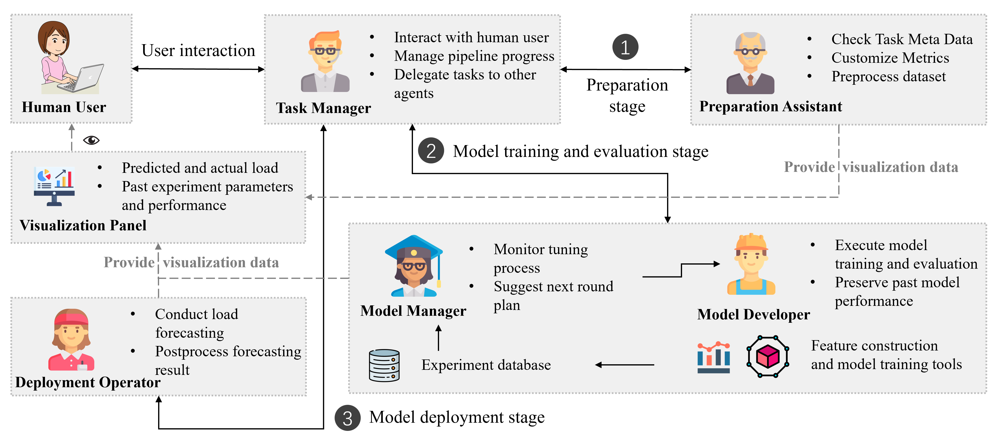
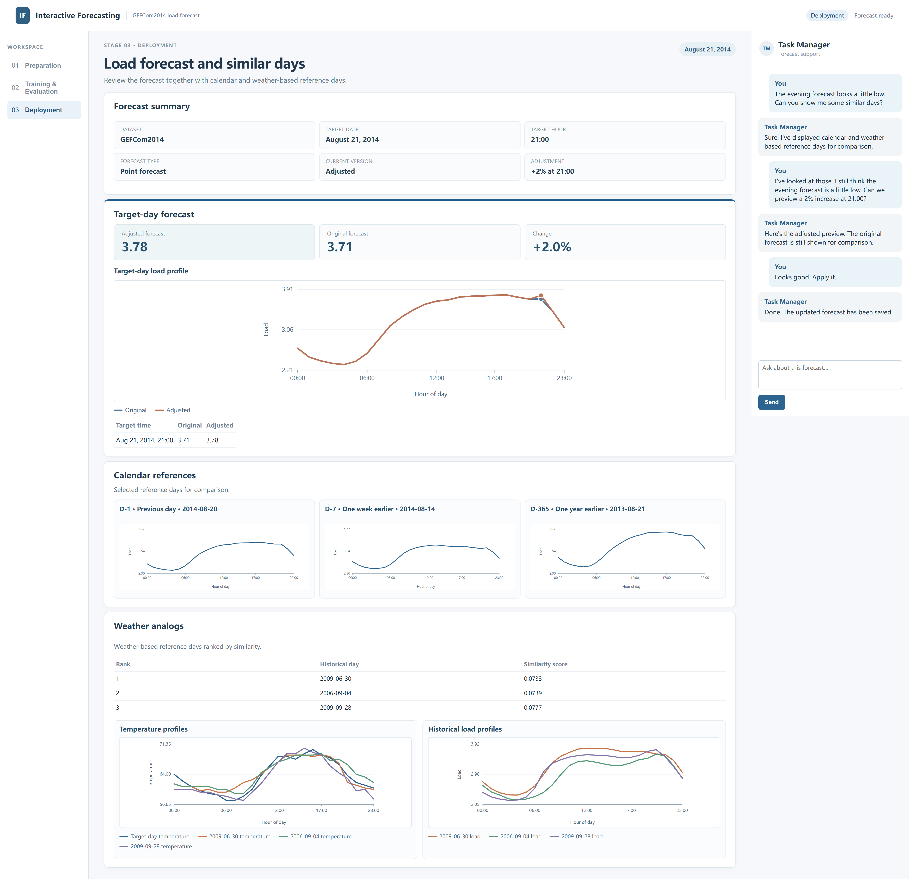
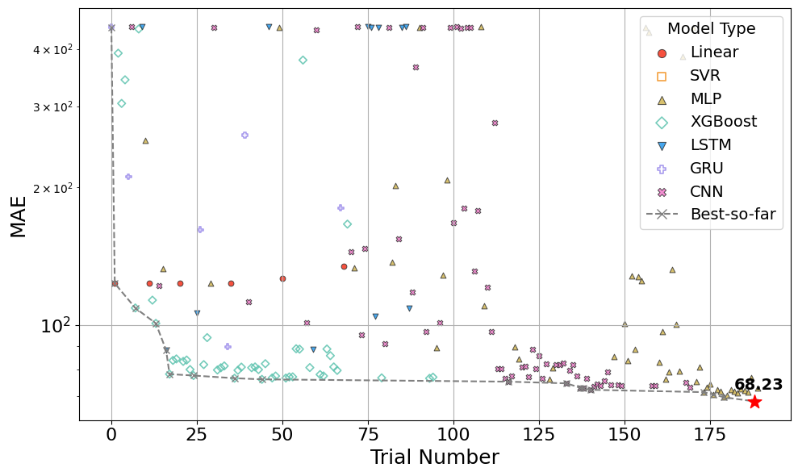

# Interactive Forecasting

Research code for **“Large Language Model-Empowered Interactive Load Forecasting”** by Yu Zuo, Dalin Qin, and Yi Wang.

This repository provides an interactive load forecasting framework that connects large language models (LLMs), forecasting models, automated configuration search, and human expertise through a multi-agent workflow. Users interact with the system in natural language to prepare forecasting tasks, guide model optimization, inspect intermediate results, and refine deployed forecasts.

## Framework

<p align="center">
  
</p>

The framework organizes the forecasting workflow into three stages:

1. **Preparation** — The Preparation Assistant helps inspect the dataset, configure data processing, and define the forecasting task.
2. **Training and Evaluation** — The Model Manager plans the optimization strategy, while the Model Developer executes feature construction, model training, and evaluation. Users can guide the search through natural-language feedback.
3. **Deployment** — The Deployment Operator generates forecasts and supports result analysis, historical reference comparison, sensitivity analysis, and user-guided postprocessing.

A **Task Manager** coordinates the workflow and serves as the interface between the user and the specialized agents.

The current implementation supports **Linear Regression, SVR, XGBoost, MLP, LSTM, GRU, and CNN**, together with automated feature selection and Bayesian optimization.

## System Demo

<p align="center">
  
</p>

The web interface provides a unified workspace for the complete forecasting workflow. Users communicate with the Task Manager while stage-specific tools and visualizations support dataset preparation, model optimization, and forecast deployment.

During optimization, users can inspect search progress and provide guidance on model families, features, and configurations. During deployment, forecasts can be compared with historical reference days and further adjusted according to operational knowledge.

## Repository Structure

```text
InteractiveForecasting/
├── src/interactive_forecasting/    # Interactive forecasting system
├── web/                            # Web interface
├── experiments/                    # Paper experiment runners and protocol
│   ├── datasets/                   # Public benchmark specifications
│   ├── protocol.json               # Frozen experiment protocol
│   ├── fixed_default.py
│   ├── vanilla_bo.py
│   ├── llm_guided.py
│   ├── probabilistic.py
│   ├── architecture_specific.py
│   └── run_all.py
├── assets/                         # README figures
├── pyproject.toml                  # Package configuration
└── README.md
```

The main application implements the interactive multi-agent workflow, while `experiments/` contains the automated experiments used to reproduce the corresponding numerical results in the paper.

## Getting Started

### Installation

Python **3.10 or newer** is recommended.

```bash
python -m venv .venv
source .venv/bin/activate

python -m pip install -e '.[backend,llm,forecasting,optimization,preparation,experiments]'
```

For LLM-enabled functionality, configure your OpenAI API key:

```bash
export OPENAI_API_KEY='your-api-key'
export IFORECAST_OPENAI_MODEL='gpt-4o'
```

Initialize the application and launch the web interface:

```bash
mkdir -p data
python -m alembic upgrade head
python -m uvicorn interactive_forecasting.api.app:app --reload
```

Then open `http://127.0.0.1:8000/` in your browser.

Preparation chat invokes the LLM Task Manager on every turn and consults the internal
Preparation Assistant for specialist reasoning. Without a configured model and key,
chat returns an unavailable error; workspace controls still work. UI and chat
confirmations use the same validated application actions.

For an opt-in, small live agent check with isolated synthetic data (no training/search):

```bash
PYTHONPATH=src python scripts/smoke_preparation_agents.py
```

The script uses `IFORECAST_OPENAI_MODEL` without selecting a fallback, and prints the
temporary directory containing SQLite call/message evidence and `report.json`.

### Datasets

The public experiment package supports three forecasting benchmarks:

| Dataset | Prepared input |
|---|---|
| **GEFCom2014** | `GEF14.csv` |
| **GEFCom2012** | `zone_*_with_temp.csv` |
| **GEFCom2017** | `aggregate_I*_merged.csv` / `mid_level_E*_merged.csv` |

Prepared hourly CSV files should be placed under:

```text
data/examples/
```

Expected columns are:

- **GEFCom2014:** `DateTime`, `load`, `T`
- **GEFCom2012:** `datetime`, `load`, `avg_temperature`
- **GEFCom2017:** `datetime`, `load`, `temperature`, `humidity`

Detailed input specifications are provided in [`experiments/datasets/`](experiments/datasets/).

The Guangdong dataset used in the paper is proprietary and therefore cannot be redistributed with this repository.

## Results

### Interactive Model Search

<p align="center">
  
</p>

The interactive optimization framework allows search decisions to incorporate both LLM reasoning and human feedback. The search trajectories above illustrate how guidance can redirect exploration when automated Bayesian optimization becomes concentrated on a limited part of the configuration space.

The comparison below reports the results from **Table VII** of the paper. Each entry shows **MAE / number of trials required to reach the reported result**.

| Dataset | Vanilla BO | LLM-Guided | Human+LLM-Guided |
|---|---:|---:|---:|
| GEFCom2014 | 73.41 / 221 | 70.25 / 219 | **68.23 / 183** |
| Guangdong | 2119.88 / 218 | 2135.64 / 225 | **1966.96 / 165** |
| GEFCom2012 Zone 1 | 1291.07 / 193 | 1273.50 / 197 | **1205.96 / 174** |
| GEFCom2012 Zone 2 | 7099.95 / 205 | 7995.31 / 184 | **6983.12 / 162** |
| GEFCom2017 I002 | 32608.57 / 201 | 32519.96 / 192 | **30960.46 / 177** |
| GEFCom2017 I003 | 6429.19 / 185 | 5629.13 / 180 | **5522.24 / 151** |

These experiments compare three search settings: standard Bayesian optimization, LLM-guided optimization based on previous trial information, and the proposed Human+LLM-Guided workflow.

## Reproducing the Paper

The repository separates **automated experiments** from the **interactive Human+LLM workflow**. Automated baselines and ablation experiments are provided under `experiments/`, while experiments involving human guidance are conducted through the interactive system described above.

### Experiment Protocol

Automated experiments use the frozen configuration in [`experiments/protocol.json`](experiments/protocol.json).

The main settings include:

- chronological **70% / 15% / 15%** train/validation/test split;
- random seed **0**;
- **300 trials** for optimization experiments;
- **300 trials per model family** for architecture-specific optimization;
- GPT-4o with temperature **0** for LLM-guided optimization;
- quantiles **[0.1, 0.5, 0.9]** for probabilistic forecasting.

The same protocol is shared across the corresponding experiment runners to maintain consistent data partitions and evaluation settings.

### Manuscript-to-Code Mapping

The experiment package is organized by **experiment type** rather than by manuscript table. A single experiment may therefore provide results used in multiple tables or figures.

| Manuscript result | Corresponding implementation |
|---|---|
| **Tables III–IV** — Hyperparameter and feature search spaces | Shared search-space definitions used by the experiment runners |
| **Table V** — Overall point forecasting comparison | `vanilla_bo.py` + interactive workflow |
| **Table VI** — Probabilistic forecasting comparison | `probabilistic.py` + interactive workflow |
| **Table VII** — Vanilla BO / LLM / Human+LLM comparison | `vanilla_bo.py`, `llm_guided.py` + interactive workflow |
| **Tables X–XII** — Fixed configurations and forecasting results | `fixed_default.py` |
| **Table XIII** — Architecture-specific optimization | `architecture_specific.py` |
| **Tables XIV–XV** — Detailed GEFCom2012 / GEFCom2017 results | `vanilla_bo.py` + interactive workflow |
| **Fig. 6** — Search trajectories | Vanilla BO and interactive search histories |
| **Fig. 11** — Default / automated / proposed comparison | `fixed_default.py`, `vanilla_bo.py` + interactive workflow |

### Running Experiments

Run all automated experiments on the prepared public datasets:

```bash
python experiments/run_all.py --protocol experiments/protocol.json
```

Run a specific experiment type and dataset:

```bash
python experiments/run_all.py \
    --experiment vanilla_bo \
    --dataset gefcom2014 \
    --protocol experiments/protocol.json
```

Available automated experiment types are:

```text
fixed_default
vanilla_bo
llm_guided
probabilistic
architecture_specific
```

A single series can also be selected with `--series`.

For example:

```bash
python experiments/run_all.py \
    --experiment architecture_specific \
    --dataset gefcom2017 \
    --series aggregate_I002 \
    --protocol experiments/protocol.json
```

LLM-guided experiments require `OPENAI_API_KEY`.

Experiment outputs are written to:

```text
experiments/output/results.json
experiments/output/report.html
```

`results.json` contains the structured numerical results and experiment provenance, while `report.html` provides a readable summary of the completed runs.